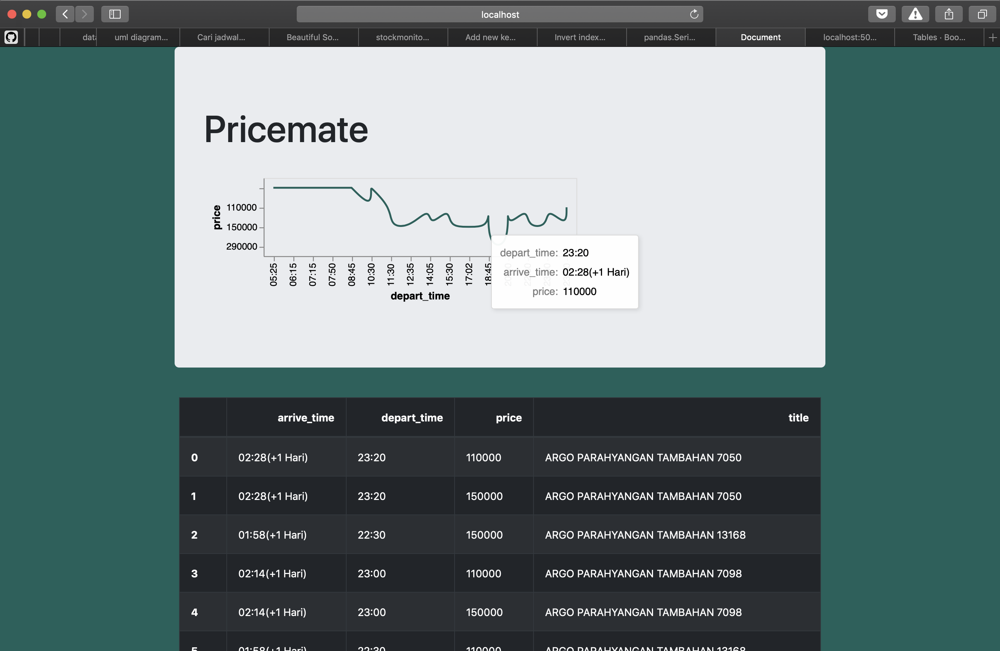

# Pricemate

## Description

Pricemate has two components:
1. A scraper that can be called from the command line
2. A web app with simple visualization

The scraper provides helper functions to scrape train ticket listings from Tiket.com, optionally sort them by departure time. 

The web app shows a simple visualization (with tooltips) of the ticket prices over time, and a simple table of all the train listings. 

## Dependencies
- Requests
- BeautifulSoup
- Pandas
- Flask
Education-oriented

## Education-oriented
- The script is only 33 lines long
- The web app is implemented with just the bare bones, sufficient to demonstrate an idea and simple enough to keep it extensible for new developers
- If you need help: reach out to me by email or open an issue.

## Maintainers
- Samuel Chan